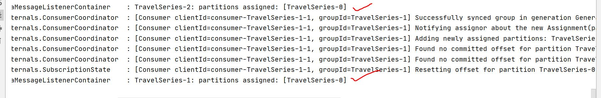
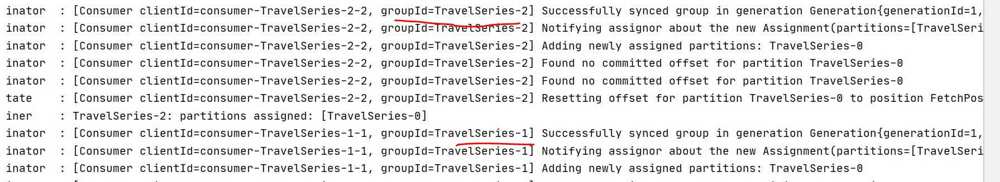
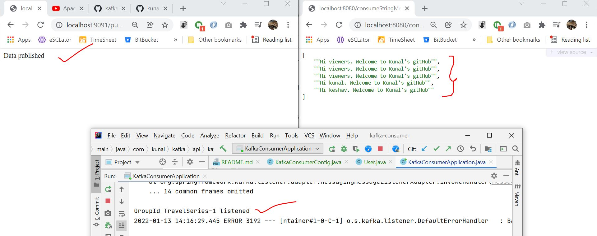
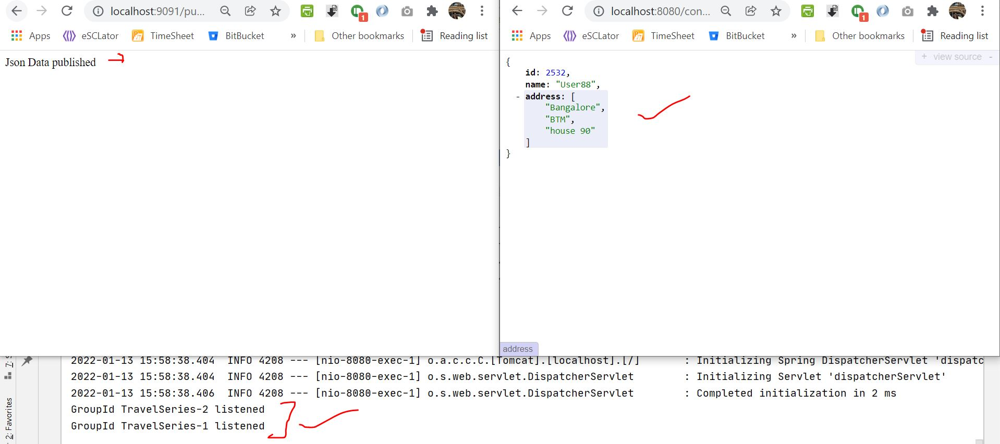

# kafka-consumer

Run the kafka publisher project 

We will first consume plain string from publisher project:
http://localhost:9091/publish/viewers

Then raw:
http://localhost:9091/publishJson

Before running our application, we should first start the zooKeeper , then the kafka server. Then we publish
the data and then we consume from this Kafka Consumer Application

To consume it we are going to use Kafka Listener. For that we will write a configuration class KafkaConsumerConfig.java, where we will mention the 
key deserializer, the value deserializer 

start zookeeper
zookeeper-server-start.bat C:\kafka_2.11-1.0.1\config\zookeeper.properties

start kafkaserver
kafka-server-start.bat C:\kafka_2.11-1.0.1\config\server.properties

Run the kakka publisher application, which we built earlier

Then Run this consumer application

In the screenshot logs above , we check consumer is up. And these are our topics with zero partition.
We didn't add any partition.

In the screenshot logs above , we see that both the groups TravelSeries1 and TravelSeries2 are registered.

Now publish the messgage multiple times

http://localhost:9091/publish/viewers - For String
http://localhost:9091/publish/kunal - For String

The consumed message can be seen by hitting the url as shown in the output above.
http://localhost:8080/consumeStringMessage
----
Now check for Json

Publisher url: http://localhost:9091/publishJson

If you hit the above url from publisher multiple times, you will get the
same response in consumer as shown below, as you are returned the same object.

http://localhost:8080/consumeJsonMessage

To do: check duplicate objects come in consumer or not ?

For more details: Visit: https://www.youtube.com/watch?v=Q0tONSPud7k&list=PLVz2XdJiJQxwoGuQb8lR-sTV26dz1SoXo&index=2
